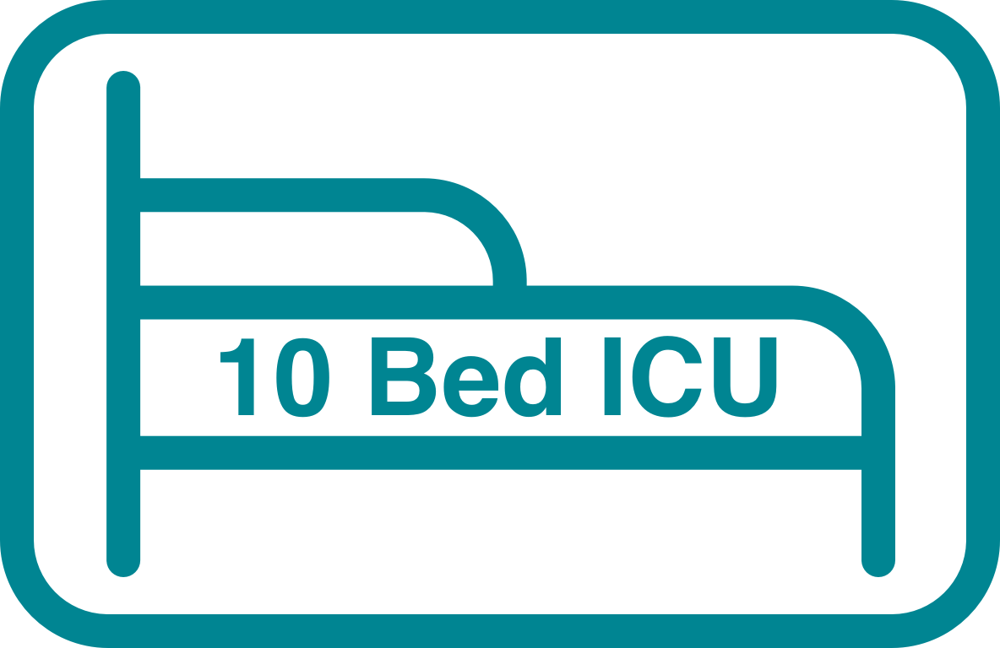

# 10-Bed-ICU | Coronasafe Network

<p align="center">
    
</p>

Creating ICUs in Rural Govt. Hospitals before the 3rd Wave.

Have a look at https://10bedicu.org/

## Getting Started

First, run the development server:

```
npm install
npm run dev
# or
yarn dev
```

Open http://localhost:3000 with your browser to see the result.

You can start editing the page by modifying pages/index.js. The page auto-updates as you edit the file.

Powered by [CoronaSafe Network](https://coronasafe.network/) | [Vercel](https://vercel.com?utm_source=life&utm_campaign=oss)
